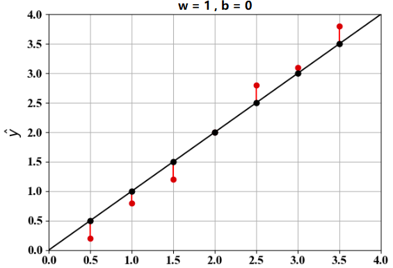
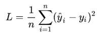
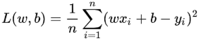
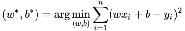
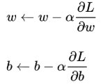
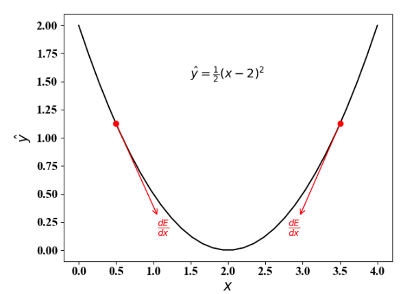
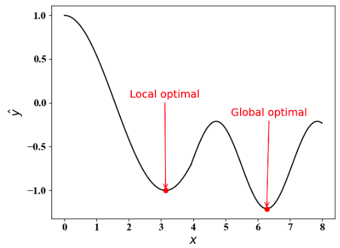

# [C# TensorFlow 2 入门教程](<https://github.com/SciSharp/TensorFlow.NET-Tutorials>)

# 二、TensorFlow.NET API

## 5. Linear Regression

### 5.1 线性回归问题

**5.1.1 问题描述** 

线性回归是回归问题中的一种，线性回归假设目标值与特征之间线性相关，即满足一个多元一次方程。通过构建损失函数，来求解损失函数最小时的参数 w 和 b 。通常我们可以表达成如下公式：

y^ = w x + b

y^ 为预测值，自变量 x 和因变量 y 是已知的，而我们想实现的是预测新增一个x，其对应的y是多少。因此，为了构建这个函数关系，目标是通过已知数据点，**求解线性模型中 w 和 b 两个参数**。

下图为 w = 1 , b = 0 的情况，其中红色的点为 自变量 x 和因变量 y 的实际值，红色线段即为误差值：

**5.1.2 问题解析**

求解最佳参数，需要一个标准来对结果进行衡量，为此我们需要定量化一个目标函数式，使得计算机可以在求解过程中不断地优化。

针对任何模型求解问题，都是最终都是可以得到一组预测值y^ ，对比已有的真实值 y ，数据行数为 n ，可以将损失函数定义如下：

即预测值与真实值之间的平均的平方距离，统计中一般称其为 MAE(mean square error) 均方误差。把之前的函数式代入损失函数，并且将需要求解的参数 w 和 b 看做是函数 L 的自变量，可得：

现在的任务是求解最小化L时 w 和 b 的值，

即核心目标优化式为：

**5.1.3 解决方案**

深度学习中一般采用梯度下降 (gradient descent) 的方法求解线性回归问题，梯度下降核心内容是对自变量进行不断的更新（针对w和b求偏导），使得目标函数不断逼近最小值的过程：

使用梯度下降法，可以对凸问题求得最优解，对非凸问题，可以找到局部最优解。梯度下降法的算法思想如下图所示：

关于梯度下降的求导过程，这里就不再详细说明，接下来，让我们通过 TensorFlow 的代码来实现一个简单的线性回归。

### 5.2 TensorFlow 下的线性回归

### 5.3 C# 和 Python 的性能比较

