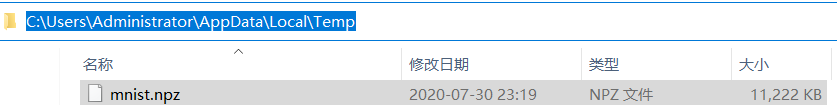

# [C# TensorFlow 2 入门教程](<https://github.com/SciSharp/TensorFlow.NET-Tutorials>)

# 二、TensorFlow.NET API

## 6. MNIST手写字符分类 Logistic Regression

### 6.1 经典的MNIST手写字符分类问题

本节内容，我们来学习下深度学习世界的HelloWorld，即经典的MNIST手写字符分类。我们一起简单了解下MNIST数据集结构和Logistic Regression，然后进入主要的代码实操。

#### 6.1.1 MNIST

MNIST是一个手写体数字的图片数据集，内容为手写体的数字 0~9 总共10种，该数据集最早来自美国国家标准与技术研究所（National Institute of Standards and Technology (NIST)），一共统计了来自250个不同的人的手写数字图片，其中50%是高中生，50%来自人口普查局的工作人员。该数据集的主要目是希望通过算法，实现对手写数字的自动识别。

MNIST数据集主要分为 训练集、训练集标签、测试集和测试集标签，由60000个训练样本和10000个测试样本组成，每个样本都是一张28 * 28像素的灰度手写数字图片，数据集详细信息如下：

| 分类       | Shape         | 样本数 |
| ---------- | ------------- | ------ |
| 训练集     | (60000,28,28) | 60000  |
| 训练集标签 | (60000,1)     | 60000  |
| 测试集     | (10000,28,28) | 10000  |
| 测试集标签 | (60000,1)     | 10000  |

有些情况下，训练集中也可以分割出 55000个训练集和5000个验证集，方便训练过程中使用验证集进行实时的训练准确度评估。

MNIST 数据集概览：

**图像的尺寸为28像素*28像素，每个像素的值为0~255的灰度值；标签为手写数字的分类值，从0到9总共10种类型的标签**，如下图所示：

我们也可以直接打印看下训练集前20个样本图片，可以看到手写的字体样式还是比较有多样性的：

针对MNIST训练集和测试集，一般的处理流程为：

1.  数据展平至 784(28*28) 
2.  数据标准归一化，[0, 255] -> [0, 1]

训练集标签和测试集标签，有些情况下，会进行 One-Hot 编码转换，这里简单介绍下One-Hot编码。

One-Hot编码向量表示为一项属性的特征向量，也就是同一时间只有一个激活点（不为0），这个向量只有一个特征是不为0的，其他都是0，因此特别稀疏，这个稀疏矩阵一般用来组成一个多特征的训练集样本。

比如MNIST的0~9总共10个数字，可用长度为10的向量表示,如0表示为{1，0，0，0，0，0，0，0，0，0}，1表示为{0，1，0，0，0，0，0，0，0，0}，该方式的优势在于，计算欧氏距离时，One-Hot编码可保证每个特征的比重一致。

**在MNIST中采用 One-Hot方式，可以保证不同数值标签之间差异的标准化，而不受实际数字大小的影响**。比如我们考虑标签1,2,3，不使用one-hot编码，其表示分别是x_1 = (1), x_2 = (2), x_3 = (3)。每两个值之间的距离是，d(x_1, x_2) = 1, d(x_2, x_3) = 1, d(x_1, x_3) = 2。那么x_1和x_3工作之间就越不相似吗？显然这样的表示，计算出来的特征的距离是不合理。如果使用one-hot编码，则得到x_1 = (1, 0, 0), x_2 = (0, 1, 0), x_3 = (0, 0, 1)，那么每两个工作之间的距离就都是sqrt(2)：即每两个工作之间的距离是一样的，显得更合理。

#### 6.1.2 Logistic Regression

机器学习中的一般有2种类型，数值预测和分类。数值预测一般是预测连续数值，采用回归模型；分类预测一般是预测离散的分类标签，方法很多，决策树，kNN，支持向量机，朴素贝叶斯等。但总体来说，2种问题的整体流程是一样的，都是搭建模型，训练已知数据，然后预测未知数据。

Logistic Regression也叫逻辑回归，是一类比较特殊的算法，从它的名字可以看出来，**这是一种采用回归的思路解决标准的分类问题的模型**。

对于这种模型，一般会将离散的数据转换为连续的概率分布数据，二分类一般采用Sigmoid(也可以采用Softmax)，多分类一般采用Softmax。**这里我们先采用Softmax回归方式将数据处理为概率分布，然后采用cross entropy交叉熵作为损失函数，最后使用梯度下降的方式进行模型参数的优化，最终优化的结果通过argmax函数进行输出精度的评价。**接下来，我们来说说这个流程中的几个重要的概念。

**① Softmax**

这个函数的作用是将一组数据转换为概率的形式，函数表达式如下：

下述这个来自 李宏毅老师《一天搞懂深度学习》书中的插图，可以方便大家理解Softmax函数：

举个例子，模型原来的输出可能是（1,2,3，……）这样的数据，可能是中间层或者末尾层，这样的数据无法使用交叉熵评价损失，而且数据的值的大小无法直观地体现实际预测的概率分布，也可能存在正负值或者极大极小值，所以需要进行数据的概率化处理，对于一个向量 (1,2,3)经过 Softmax 回归之后就是：

，

这样输出就转换为一个概率分布，方便下面的交叉熵计算。

总体来说，构建这个Softmax的思路主要是满足下述条件：

1. **soft特性，使所有标签都有概率值，即所有分类都存在被考虑的“可能性”；**

2. **函数必须是连续可导的，不存在拐点；**

3. **max特性，通过指数的使用，拉大不同类型的差异，使大的更大，小的更小；**

4. **所有输出概率的总和始终确保为1；**

5. **尽可能地方便后续的交叉熵损失函数的求导计算**

   **（后面可以看到详细的推导，Softmax大大简化了导数的计算和梯度更新）。**

上面5点即是我总结的该softmax函数的构造原理和主要特征。

**② cross entropy 交叉熵**

交叉熵是信息论中的一个重要概念，主要用来度量2个概率分布间的差异，**总结来说，在深度学习中可以使用交叉熵来“量化”真实数据分布概率和预测数据分布概率之间的差异，进而可以进行后续的梯度更新的数值和方向。**

接下来我们来详细说说交叉熵损失的前世今生（尽量不涉及太多推导公式，读者也可以直接跳过下面这段直接看上面这个总结，并不影响后续的代码理解）。

首先我们来看看什么是信息量，信息学奠基人香农（Shannon）认为“信息是用来消除随机不确定性的东西”，也就是说 **衡量信息量的大小就是看这个信息消除不确定性的程度**。对于越确定的事情，描述该事情的状态的信息量就越少，比如你对朋友说：“太阳明天会从东方升起！”，这条信息并没有减少不确定性，因为太阳肯定是从东边升起的，这是一句废话，信息量为0（同时你的朋友听到这个消息只会无动于衷）；但是如果你对朋友说：“刚刚中国足球队赢得了世界杯的冠军！”，这句话就具有很大的信息量，因为中国队赢得世界杯的不确定性因素非常大，而这句话消除了赢得世界杯的不确定性，所以按照定义，这句话的信息量很大（同时你的朋友可能会从地上吃惊地跳了起来）。

根据上述可总结如下：**信息量的大小与信息发生的概率成反比**。概率越大，信息量越小。概率越小，信息量越大。公式如下：

信息量 I ( x ) = - ln ( P ( x ) ) ，P ( x ) 为事件发生的概率。

了解了信息量，我们来学习下信息熵。

信息熵主要用来表示**所有信息量的期望**，期望是试验中每次可能结果的概率乘以其结果的总和。公式如下(其中log代表ln)：

我们深度学习主要关注分布概率之间（预测分布概率和实际分布概率）的差异，这里有个概念为相对熵（KL散度），相对熵主要用来**衡量两个概率分布之间的差异**。公式如下(其中log代表ln)：

那么为什么我们要选择交叉熵来表示 预测分布概率和实际分布概率 的差异呢？

将KL散度公式拆开：

而交叉熵公式为：

H(p(x))表示信息熵，从上述公式可以看出，**相对熵 = 交叉熵 - 信息熵**

在机器学习训练网络时，输入数据与标签一般已经确定，那么真实概率分布P(x)也就确定下来了，所以信息熵在这里就是一个常量。由于相对熵的值表示真实概率分布P(x)与预测概率分布Q(x)之间的差异，值越小表示预测的结果越好，所以需要最小化相对熵，而交叉熵等于相对熵加上一个常量（信息熵），且公式相比KL散度更加容易计算，所以在机器学习中常常使用交叉熵损失函数来计算loss就行了。

使用交叉熵还有一个前提，概率分布 p(X=x)必须要满足下述公式：

我们结合softmax公式来一起看下交叉熵loss的完整求导：

我们的交叉熵loss(C)对于神经元的输出(z_i)的梯度为

[md格式公式：
$$
{∂C}\over{∂z_i}
$$
]，

根据复合函数的链式求导法则：

[md格式公式：
$$
{{∂C}\over{∂z_i}}={{{∂C}\over{∂a_j}}{{∂a_j}\over{∂z_i}}}
$$
]，

这里是aj而不是ai的原因，是由于softmax公式的特性，它的分母包含了所有神经元的输出，所以，对于不等于i的其他输出里面，也包含着zi，所有的a都要纳入到计算范围中。因此，后面的计算需要分为i=j和i≠j两种情况求导。
下面我们一个一个分开推导，我们将交叉熵函数C代入第一个，推导如下：

[md格式公式：
$$
{{∂C}\over{∂a_j}}={{∂{(-{\sum{_{j}y_jlna_j}})}}\over{∂a_j}}={-{\sum\limits_jy_j{1\over{a_j}}}}
$$
]，

第2个推导如下：

① i = j 的情况：

[md格式公式：
$$
{∂a_i\over{∂z_i}}={{∂({{e^{z_i}}\over{\sum_ke^{z_k}}})}\over{∂z_i}}={(e^{z_i}{1\over{\sum_ke^{z_k}}})-{{{(e^{z_i})}^2}\over{{(\sum_ke^{z_k})}^2}}}={({{e^{z_i}}\over{\sum_ke^{z_k}}})(1-{{e^{z_i}}\over{\sum_ke^{z_k}}})}={a_i(1-a_i)}
$$
]
② i ≠ j 的情况：

[md格式公式：
$$
{∂a_j\over{∂z_j}}={{∂({{e^{z_i}}\over{\sum_ke^{z_k}}})}\over{∂z_i}}={-e^{z_j}({1\over{\sum_ke^{z_k}}})^2e^{z_i}}={-a_ia_j}
$$
]
接下来，我们将上面的组合：

[md格式公式：
$$
{∂C\over∂z_i}={(-{\sum\limits_jy_j{1\over{a_j}}}){∂a_j\over∂z_i}}={-{y_i\over{a_i}}a_i(1-a_i)+\sum\limits_{j≠i}{y_i\over{a_j}}a_ia_j}={-y_i+y_ia_i+\sum\limits_{j≠i}y_ja_i}={-y_i+a_i\sum_jy_j}
$$
]
最后，针对分类问题，我们给定的结果yi最终只会有一个类别是1，其他类别都是0，因此，对于分类问题，这个梯度等于：

[md格式公式：
$$
{∂C\over∂z_i}=a_i-y_i=a_i-1
$$
]
求导公式一下子看起来十分简洁，我们算得的梯度就是神经元的输出-1，我们只需要正向求出Y的预测值，将结果减1就是反向更新的梯度，导数的计算是不是变得非常简单！

这就是为什么我们使用Softmax回归对输出地数据先进行处理，本来模型对于一张图片的输出是不符合概率分布的，经过Softmax回归转化之后，就可以使用交叉熵来衡量了，同时loss的求导公式也大大简化。

看完交叉熵的选择过程，我们来举个简单的例子：

在MNIST中，某一张图片的真实标签是这样的形式（One-Hot）：(1, 0, 0, …) ，对于这张图片，我们的模型的输出可能是 (0.5, 0.3, 0.2) 这样的形式，那么计算交叉熵就是 −(1×log(0.5)+0×log(0.3)+0×log(0.2)) ，这样就量化地计算出了预测概率分布和实际概率分布之间的差异值。

这里还用到了一个函数 ： **tf.clip_by_value()，这个函数是将数组中的值限定在一个范围内**，定义如下：

clip_by_value<T1,T2>(Tensor t, T1 clip_value_min, T2 clip_value_max, string name = "ClipByValue") 

参数1：Tensor t，输入的待运算Tensor

参数2：T1 clip_value_min，最小取值

参数3：T2 clip_value_max，最大取值

经过这个函数，小于clip_value_min 的数值就会被替换为clip_value_min， 同样，大于的会被替换为clip_value_max，所以用在交叉熵中就保证了计算的合法性。

经过上述的一系列流程，我们对loss函数（交叉熵）进行优化，交叉熵越小，也就说明模型预测的输出越接近实际的结果，接下来使用梯度下降不断更新参数，找到最小的loss，就是最优的模型参数了。

### 6.2 TensorFlow.NET 代码实操

终于到了代码实操的环节，我们先通过一个简明图示快速回顾一下 MNIST Logistic Regression 的完整流程：

C:\Users\Administrator\AppData\Local\Temp

### 6.3 视频教程

视频教程链接地址（或扫描下面的二维码）：
